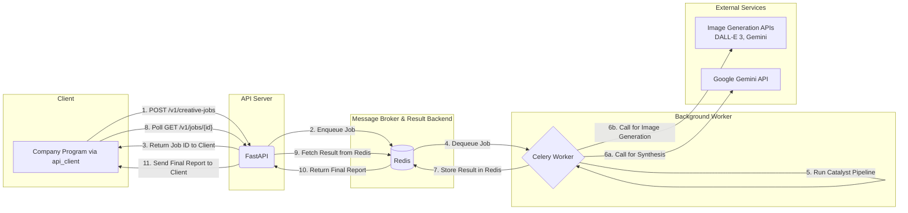

# Creative Catalyst Engine - Project Wiki & Developer's Guide

Welcome to the central knowledge base for the Creative Catalyst Engine. This document provides a deep dive into the project's architecture, file structure, data flows, and development patterns. It is intended to be the single source of truth for any developer working on this system.

## Table of Contents

- [Creative Catalyst Engine - Project Wiki \& Developer's Guide](#creative-catalyst-engine---project-wiki--developers-guide)
  - [Table of Contents](#table-of-contents)
  - [1. High-Level Overview](#1-high-level-overview)
    - [Project Mission](#project-mission)
    - [Guiding Principles](#guiding-principles)
  - [2. Core Architecture](#2-core-architecture)
    - [System Components](#system-components)
    - [Architectural Diagram](#architectural-diagram)
  - [3. Detailed Directory \& File Breakdown](#3-detailed-directory--file-breakdown)
    - [Root Directory](#root-directory)
    - [The `api/` Directory](#the-api-directory)
    - [The `api_client/` Directory](#the-api_client-directory)
    - [The `catalyst/` Directory (The Core Engine)](#the-catalyst-directory-the-core-engine)
      - [`catalyst/clients/`](#catalystclients)
      - [`catalyst/caching/`](#catalystcaching)
      - [`catalyst/models/`](#catalystmodels)
      - [`catalyst/pipeline/`](#catalystpipeline)
      - [`catalyst/pipeline/processors/`](#catalystpipelineprocessors)
      - [`catalyst/pipeline/processors/generation/`](#catalystpipelineprocessorsgeneration)
      - [`catalyst/prompts/`](#catalystprompts)
      - [`catalyst/utilities/`](#catalystutilities)
  - [4. Data Flow: Anatomy of a Request](#4-data-flow-anatomy-of-a-request)
  - [5. Key Components Deep Dive](#5-key-components-deep-dive)
    - [The `RunContext` Object](#the-runcontext-object)
    - [The `PipelineOrchestrator`](#the-pipelineorchestrator)
    - [The Image Generator "Strategy Pattern"](#the-image-generator-strategy-pattern)
  - [6. Configuration Guide (`.env`)](#6-configuration-guide-env)
  - [7. Running \& Interacting with the Project](#7-running--interacting-with-the-project)
  - [8. Extending the Project](#8-extending-the-project)
    - [How to Add a New Image Generator](#how-to-add-a-new-image-generator)
    - [How to Add a New Pipeline Step](#how-to-add-a-new-pipeline-step)

---

## 1. High-Level Overview

### Project Mission

The Creative Catalyst Engine is a scalable web service that transforms high-level creative briefs into comprehensive, multi-format fashion intelligence packages. It automates the ideation-to-image pipeline, delivering structured data (JSON reports) and editorial-quality images suitable for creative workflows.

### Guiding Principles

-   **Asynchronous First:** Creative AI tasks are time-consuming. The system is built around a non-blocking, asynchronous job queue model to ensure the API is always responsive.
-   **Scalability:** By decoupling the web server (FastAPI) from the background workers (Celery), the system can be scaled independently. More workers can be added to handle increased load without affecting the API's performance.
-   **Modularity & Extensibility:** The core pipeline is built from interchangeable components (processors and generators). This makes it easy to add, remove, or swap out functionality—such as changing the image generation model—with minimal code changes.
-   **Resilience:** The system includes robust error handling, retries for transient network issues, and fallback synthesis paths to ensure a high success rate for job completion.

---

## 2. Core Architecture

### System Components

-   **API Server (FastAPI):** The public-facing "front door." Its only jobs are to accept new requests, place them in the queue, and provide status updates. It is lightweight and fast.
-   **Message Broker (Redis):** The central communication hub. It holds the queue of pending jobs and stores the final results when they are complete.
-   **Background Worker (Celery):** The "engine room." This is a separate process that continuously watches the Redis queue. When a new job appears, it pulls the job and executes the entire, long-running creative pipeline.
-   **Client (`api_client`):** A Python library that abstracts away the complexity of the asynchronous API, allowing other programs to interact with the service through a simple function call.

### Architectural Diagram



---

## 3. Detailed Directory & File Breakdown

### Root Directory

-   **`.env`**: **(Local Configuration)** Not version-controlled. Stores all secrets, API keys, and environment-specific settings.
-   **`requirements.txt`**: A list of all Python dependencies for the project.
-   **`README.md`**: The public-facing overview of the project.
-   **`CONTRIBUTING.md`**: A developer's guide for working on the project.
-   **`PROJECT_WIKI.md`**: This file. The deep-dive technical documentation.
-   **`clear_cache.py`**: A utility script to safely delete the ChromaDB vector cache.

### The `api/` Directory

This directory contains the code for the runnable web service.

-   **`main.py`**
    -   **Role:** The public-facing API server.
    -   **Responsibilities:**
        -   Initializes the FastAPI application.
        -   Defines the API endpoints (`POST /v1/creative-jobs`, `GET /v1/creative-jobs/{job_id}`).
        -   Accepts new job requests and dispatches them to the Celery queue.
        -   Retrieves job status and results from the Redis backend.
        -   Serves the generated images from the `/results` static directory.
    -   **Input:** HTTP requests from clients.
    -   **Output:** HTTP JSON responses.

-   **`worker.py`**
    -   **Role:** The Celery background worker definition.
    -   **Responsibilities:**
        -   Configures the Celery application, connecting it to the Redis broker.
        -   Defines the main background task (`create_creative_task`).
        -   This task is the bridge between the API world and the core `catalyst` engine. It calls `run_pipeline`.
        -   After the pipeline completes, it formats the final dictionary, constructs public image URLs, and returns the result.
    -   **Input:** A `user_passage` string from the Celery queue.
    -   **Output:** A dictionary containing the final report and image URLs, which is stored in the Redis result backend.

-   **`eventlet_worker.py`**
    -   **Role:** An alternative entry point for the Celery worker, specifically for macOS.
    -   **Responsibilities:**
        -   Performs `eventlet.monkey_patch()` to resolve networking issues on macOS.
        -   Imports and exposes the `celery_app` from `worker.py`.

### The `api_client/` Directory

This is the standalone Python library (SDK) that other applications use to interact with the API.

-   **`client.py`**
    -   **Role:** The primary client class that simplifies API interaction.
    -   **Responsibilities:**
        -   Provides the `CreativeCatalystClient` class.
        -   The `get_creative_report` method encapsulates the entire async workflow: job submission, polling for status, and result retrieval.
        -   Handles timeouts and converts successful JSON responses into Python dictionaries.
    -   **Input:** A `passage` string.
    -   **Output:** A Python dictionary containing the final report and image URLs.

-   **`exceptions.py`**
    -   **Role:** Defines custom, predictable errors for the client.
    -   **Responsibilities:**
        -   Provides specific exceptions like `JobFailedError` and `PollingTimeoutError`.
        -   This allows the consuming application to build robust error-handling logic.

-   **`example.py`**
    -   **Role:** A runnable demonstration and blueprint for using the client.
    -   **Responsibilities:**
        -   Shows how to initialize the `CreativeCatalystClient`.
        -   Calls `get_creative_report` and prints the results.
        -   Includes a helper function to download the images from the returned URLs.

### The `catalyst/` Directory (The Core Engine)

This is the heart of the project, containing all the AI logic, data models, and pipeline orchestration. It is completely independent of the API layer.

-   **`main.py`**
    -   **Role:** The main entry point for the core creative pipeline.
    -   **Responsibilities:**
        -   Contains the `run_pipeline` function, which is the primary function called by the Celery worker.
        -   Initializes the `RunContext` object.
        -   Instantiates and runs the `PipelineOrchestrator`.
        -   Handles the final renaming of the results directory.
    -   **Input:** A `user_passage` string.
    -   **Output:** The final, populated `RunContext` object.

-   **`settings.py`**
    -   **Role:** The central configuration hub for the application.
    -   **Responsibilities:**
        -   Loads all environment variables from the `.env` file.
        -   Defines application-wide constants (file paths, model names, etc.).
        -   Fails fast if critical settings (like API keys) are missing.

-   **`context.py`**
    -   **Role:** Defines the `RunContext` data object.
    -   **Responsibilities:**
        -   The `RunContext` acts as the "data bus" or "bloodstream" of the pipeline, passed from one step to the next.
        -   It accumulates all data and artifacts generated during a single run.

#### `catalyst/clients/`

-   **`gemini_client.py`**
    -   **Role:** A dedicated, resilient client for all **text-based** interactions with the Google Gemini API.
    -   **Responsibilities:**
        -   Handles authentication and client initialization.
        -   Provides the `generate_content_async` function with built-in retries and backoff.
        -   Includes logic to clean and validate Pydantic schemas for structured JSON output.
        -   Provides the `generate_embedding_async` function for the caching system.

#### `catalyst/caching/`

-   **`cache_manager.py`**
    -   **Role:** A high-level interface (Facade) for the caching system.
    -   **Responsibilities:**
        -   Creates a deterministic cache key from a user's brief.
        -   Calls the underlying `report_cache` to check for or add reports.

-   **`report_cache.py`**
    -   **Role:** The low-level implementation of the L1 (full report) cache.
    -   **Responsibilities:**
        -   Initializes and interacts with the ChromaDB vector database.
        -   Performs semantic vector searches to find similar, previously generated reports.

#### `catalyst/models/`

-   **`trend_report.py`**
    -   **Role:** Defines the data structure for the final output.
    -   **Responsibilities:**
        -   Contains all Pydantic models (`FashionTrendReport`, `KeyPieceDetail`, etc.).
        -   This file acts as the definitive schema for the entire creative report, ensuring all generated data is valid and well-structured.

#### `catalyst/pipeline/`

-   **`orchestrator.py`**
    -   **Role:** The "brain" of the creative process.
    -   **Responsibilities:**
        -   Defines the sequence of all pipeline steps (the processors).
        -   Executes each step in order, passing the `RunContext` between them.
        -   Implements the high-level logic, including the L1 cache check and the fallback to the direct knowledge synthesis path if the primary path fails.
        -   Checks the `ENABLE_IMAGE_GENERATION` flag to decide whether to run the image generation stage.

-   **`base_processor.py`**
    -   **Role:** Defines the "contract" for all pipeline steps.
    -   **Responsibilities:**
        -   Provides the `BaseProcessor` abstract base class.
        -   Ensures every processor has a `process(self, context: RunContext)` method.

#### `catalyst/pipeline/processors/`

This directory contains the individual, modular steps of the pipeline.

-   **`briefing.py`**: Contains processors for the initial "Briefing" stage (deconstructing and enriching the user's prompt).
-   **`synthesis.py`**: Contains processors for the core "Synthesis" stage (web research, structuring, and report generation).
-   **`reporting.py`**: Contains the `FinalOutputGeneratorProcessor`, which creates the final image prompts and saves the JSON report file.

#### `catalyst/pipeline/processors/generation/`

This directory implements the "Strategy Pattern" for pluggable image generation models.

-   **`__init__.py`**
    -   **Role:** The "Factory" that selects the correct image generator.
    -   **Responsibilities:**
        -   Reads the `IMAGE_GENERATION_MODEL` setting from the `.env` file.
        -   Returns an instance of the corresponding generator class.

-   **`base_generator.py`**
    -   **Role:** Defines the "contract" for all image generators.
    -   **Responsibilities:**
        -   Provides the `BaseImageGenerator` abstract base class.
        -   Ensures every generator has an `async def generate_images(self, context: RunContext)` method.

-   **`dalle3_generator.py`**, **`gpt_image1_generator.py`**, **`nanobanana_generator.py`**
    -   **Role:** Concrete implementations of the image generation strategy.
    -   **Responsibilities:**
        -   Each file contains a class that implements the logic for interacting with a specific image model API.
        -   They are responsible for generating and saving the final image files.

#### `catalyst/prompts/`

-   **`prompt_library.py`**
    -   **Role:** A centralized library for all master prompt templates.
    -   **Responsibilities:**
        -   Stores all the large, complex prompts used by the LLM, keeping them separate from the application logic.

#### `catalyst/utilities/`

-   **`logger.py`**: Configures the application-wide structured logger.
-   **`config_loader.py`**: Loads and formats the `sources.yaml` file.

---

## 4. Data Flow: Anatomy of a Request

1.  **Submission:** The `api_client` sends a `POST` request with `{"user_passage": "..."}` to `api/main.py`.
2.  **Queuing:** `api/main.py` creates a Celery task with the passage and immediately returns a `job_id`. The task is placed in the Redis queue.
3.  **Execution:** A `api/worker.py` process picks up the task from Redis.
4.  **Pipeline Start:** The worker calls `catalyst/main.py:run_pipeline()`, which creates a `RunContext` object.
5.  **Orchestration:** `run_pipeline` calls `catalyst/pipeline/orchestrator.py:run()`.
6.  **Briefing Stage:** The orchestrator executes the processors in `briefing.py` to create a structured `enriched_brief` inside the `RunContext`.
7.  **Cache Check:** The orchestrator uses `caching/cache_manager.py` to see if a similar report already exists. If yes, it loads the report and skips to step 10.
8.  **Synthesis Stage:** The orchestrator executes the processors in `synthesis.py`. This involves web research, structuring the data, and finally generating the `final_report` dictionary within the `RunContext`.
9.  **Reporting Stage:** The orchestrator runs `reporting.py:FinalOutputGeneratorProcessor`, which generates the detailed image prompts and saves the final JSON report to a file.
10. **Image Generation Stage:** The orchestrator checks the `ENABLE_IMAGE_GENERATION` flag. If `True`, it calls the factory in `generation/__init__.py` to get the currently selected image generator (e.g., `DalleImageGeneration`). It then calls the `generate_images` method on that object, which generates and saves the `.png` files.
11. **Completion:** The `run_pipeline` function completes, returning the final `RunContext` to the worker.
12. **Result Formatting:** The `api/worker.py` task scans the results directory for the saved images, constructs public URLs for them, and packages the `final_report` and `image_urls` into a final dictionary.
13. **Storage:** The worker stores this final dictionary in the Redis result backend, keyed by the `job_id`.
14. **Polling & Retrieval:** The `api_client` has been polling the `GET` endpoint. It now receives the "complete" status and the final result dictionary from Redis.
15. **Delivery:** The `api_client` returns the dictionary to the consuming application.

---

## 5. Key Components Deep Dive

### The `RunContext` Object

Think of the `RunContext` as the "story" of a single job. It is created at the very beginning and is passed through every single step of the pipeline. Each processor reads information from it and adds its own results back to it. This avoids the need for global variables and ensures each run is completely isolated.

### The `PipelineOrchestrator`

This is the "general contractor" for the project. It doesn't do any of the work itself, but it knows the exact order in which the "subcontractors" (the processors) need to be called. Its primary job is to manage the flow of control and data through the system.

### The Image Generator "Strategy Pattern"

This is a powerful design pattern that allows you to define a family of algorithms (image generators), encapsulate each one, and make them interchangeable. The `PipelineOrchestrator` doesn't need to know the details of DALL-E 3 or Gemini; it just needs to know that it has an "image generator" object that has a `generate_images` method. The factory in `generation/__init__.py` is responsible for deciding which concrete generator to provide at runtime based on your configuration.

---

## 6. Configuration Guide (`.env`)

-   **`GEMINI_API_KEY`**: **(Required)** Your API key for Google AI Studio. Used for all text synthesis and, if selected, image generation.
-   **`OPENAI_API_KEY`**: **(Required)** Your API key for OpenAI. Used for DALL-E and GPT-Image-1 models.
-   **`ENABLE_IMAGE_GENERATION`**: **(Master Switch)** Set to `True` or `False`. If `False`, the entire image generation stage is skipped, resulting in faster, text-only reports.
-   **`IMAGE_GENERATION_MODEL`**: The model to use if `ENABLE_IMAGE_GENERATION` is `True`.
    -   **Options:** `"dall-e-3"`, `"gpt-image-1"`, `"nano-banana"`.
-   **`REDIS_URL`**: The connection URL for your Redis server. Defaults to `redis://localhost:6379/0`.

---

## 7. Running & Interacting with the Project

(This section would contain the commands from the `README.md` for starting Redis, Celery, and the API server, as well as the `curl` and `python -m api_client.example` commands.)

---

## 8. Extending the Project

### How to Add a New Image Generator

1.  **Create the File:** Create a new file in `catalyst/pipeline/processors/generation/`, e.g., `new_model_generator.py`.
2.  **Create the Class:** Inside the new file, create a class that inherits from `BaseImageGenerator`.
    ```python
    from .base_generator import BaseImageGenerator

    class NewModelGeneration(BaseImageGenerator):
        async def generate_images(self, context: RunContext) -> RunContext:
            # Your logic here
            return context
    ```
3.  **Implement the Logic:** Fill in the `__init__` method to configure the client and the `generate_images` method with the API call logic for the new model.
4.  **Update the Factory:** In `catalyst/pipeline/processors/generation/__init__.py`, import your new class and add an `elif` block to the `get_image_generator` function.
    ```python
    elif model_name == "new-model":
        return NewModelGeneration()
    ```
5.  **Update Configuration:** Add `"new-model"` as an option in your `.env` file and `README.md`.

### How to Add a New Pipeline Step

1.  **Create the Processor:** Create a new class in one of the `processors` files (e.g., `briefing.py`) that inherits from `BaseProcessor`.
2.  **Implement the `process` Method:** Add your logic to the `async def process(self, context: RunContext)` method. It should read from and write to the `context` object.
3.  **Insert into Orchestrator:** In `catalyst/pipeline/orchestrator.py`, add an instance of your new processor to one of the pipeline lists (e.g., `briefing_pipeline`) in the desired order.