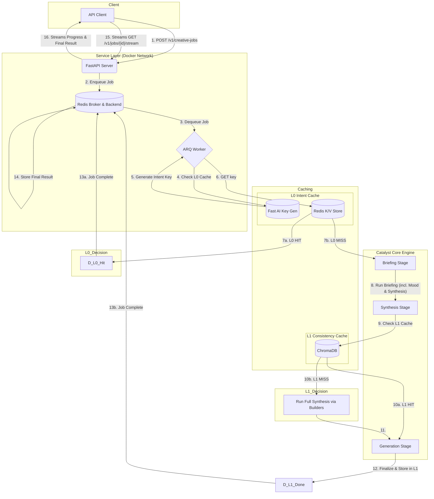

# 🚀 Creative Catalyst Engine

[](https://github.com/your-repo/creative-catalyst-engine)
[](LICENSE)

The **Creative Catalyst Engine** is an AI-powered, idea-to-image pipeline delivered as a scalable and resilient web service. It transforms a simple creative brief into a multi-format fashion intelligence package: a structured trend report (JSON), an art-directed style guide, and a suite of editorial-quality images.

Built on a robust, modern stack of **FastAPI, ARQ, Redis, and ChromaDB**, the engine is fully containerized with Docker and managed by a simple `Makefile` command interface for perfect reproducibility and ease of use.

---

## Table of Contents

- [🚀 Creative Catalyst Engine](#-creative-catalyst-engine)
  - [Table of Contents](#table-of-contents)
  - [1. Getting Started](#1-getting-started)
    - [Prerequisites](#prerequisites)
    - [First-Time Setup](#first-time-setup)
    - [Running the Application](#running-the-application)
  - [2. Day-to-Day Workflow](#2-day-to-day-workflow)
    - [Interacting with the Engine](#interacting-with-the-engine)
    - [Modifying Code](#modifying-code)
    - [Managing Dependencies \& Environments](#managing-dependencies--environments)
    - [Running Scripts \& Tests](#running-scripts--tests)
  - [3. Debugging](#3-debugging)
    - [Method 1: Real-Time Log Tailing](#method-1-real-time-log-tailing)
    - [Method 2: Interactive Debugging with VS Code](#method-2-interactive-debugging-with-vs-code)
  - [4. Architecture Deep Dive](#4-architecture-deep-dive)
    - [Guiding Principles](#guiding-principles)
    - [Key Features](#key-features)
    - [Architecture Diagram](#architecture-diagram)
    - [Repository Structure](#repository-structure)
  - [5. Troubleshooting](#5-troubleshooting)

---

## 1. Getting Started

This project is fully containerized. The primary workflow uses a `Makefile` to simplify and orchestrate all Docker commands.

### Prerequisites

*   **Docker Desktop:** The primary requirement for running the application.
*   **Make:** A standard command-line tool, available by default on macOS and Linux.
*   **Python 3.11+:** Required *only* for managing dependencies and IDE integration.

### First-Time Setup

1.  **Clone the Repository:**
    ```bash
    git clone https://github.com/MTawhid7/creative-catalyst-engine.git
    cd creative-catalyst-engine
    ```
2.  **Create Your Local Environment:**
    Set up a local virtual environment. This is used for IDE integration and dependency management tools.
    ```bash
    python3 -m venv venv
    source venv/bin/activate
    pip install pip-tools
    ```
3.  **Create the `.env` File:**
    Copy the provided `.env.example` file to `.env`. This file is ignored by Git and will hold your secret keys.
    ```bash
    cp .env.example .env
    ```
4.  **Configure Your Secrets:**
    Open the newly created `.env` file and fill in your secret keys (e.g., `GEMINI_API_KEY`, `SENTRY_DSN`, `ASSET_BASE_URL`).

### Running the Application

The entire application stack is orchestrated with simple `make` commands.

1.  **Ensure Docker Desktop is running.**
2.  **Open a terminal** in the project's root directory (no `venv` needed).
3.  **Build and Run the Services:**
    ```bash
    make up
    ```
    *   The first time you run this, the build process will be slow. Subsequent starts will be very fast.

The application is ready when you see logs from all services, including:
`Uvicorn running on http://0.0.0.0:9500` and `ARQ worker started. Ready to process creative jobs.`

To stop the entire application, press `Ctrl+C` in the terminal, then run `make down`.

---

## 2. Day-to-Day Workflow

### Interacting with the Engine

The recommended way to test the running service is with the provided API client.

1.  **Start the application** with `make up`.
2.  **In a separate terminal,** modify the test prompt in `api_client/example.py`.
3.  **Run the client:**
    ```bash
    make run-client
    ```
    You will see live progress updates as the worker runs through each stage of the pipeline.

### Modifying Code

The project is configured with a **live-sync volume**. When you save a change to a `.py` file, the change is instantly reflected inside the running Docker containers. The FastAPI server will automatically restart. To apply changes to the worker, you must manually restart it:
```bash
make restart-worker
```

### Managing Dependencies & Environments

This project uses `pip-tools` for robust, deterministic dependency management across both the local and Docker environments.

*   **To add or change a dependency:** Edit the high-level `requirements.in` or `dev-requirements.in` file.

*   **To update the lockfiles (`.txt`):**
    1.  Activate your local virtual environment: `source venv/bin/activate`
    2.  Run the compile command: `make deps`

*   **To sync your local `venv` for VS Code:** After updating dependencies, sync your local environment to match the lockfiles. This is crucial for the VS Code Test Explorer and IntelliSense.
    ```bash
    make sync-venv
    ```

*   **To update the Docker test environment:** After updating dependencies, you must rebuild the Docker images.
    ```bash
    make build
    ```

### Running Scripts & Tests

Use `make` commands to execute one-off tasks inside a temporary container.

*   **To Clear All Caches:** `make clear-cache`
*   **To Run the Full Test Suite:** `make test`
*   **To Open a Shell Inside the Worker:** `make shell`

---

## 3. Debugging

### Method 1: Real-Time Log Tailing

For a cleaner view of the logs for a specific service, run one of the following commands in a separate terminal:

```bash
make logs-worker
```
```bash
make logs-api
```

### Method 2: Interactive Debugging with VS Code

You can set breakpoints in VS Code and debug your code while it runs *inside the containers*.

1.  **Launch in Debug Mode:**
    Start the application using the dedicated debug command.

    ```bash
    make debug
    ```
2.  **Set a Breakpoint** in any `.py` file in VS Code.

3.  **Attach the Debugger:**
    *   Go to the "Run and Debug" panel in VS Code.
    *   From the dropdown, select either **"Attach to API (Docker)"** or **"Attach to Worker (Docker)"**.
    *   Click the green play button.

4.  **Trigger the Code:**
    Send a request to your API using `make run-client`. Execution will pause at your breakpoint.

---

## 4. Architecture Deep Dive

### Guiding Principles

*   **Separation of Concerns:** The **Service Layer** (`api/`) is strictly decoupled from the **Core Engine** (`catalyst/`).
*   **Strategy-Based Logic:** Complex operations are encapsulated in dedicated "builder" classes.
*   **Deterministic Resilience:** The system is designed to be resilient not by asking an AI to fix its own errors, but by using a robust, code-based sanitization pipeline to proactively clean and validate AI responses.
*   **Production-Ready by Design:** The entire application is containerized and managed via environment variables.


### Key Features
*   **True Asynchronous Processing**: A FastAPI front-end accepts jobs and queues them to **ARQ (Async-Redis-Queue)**, a modern, high-performance `asyncio`-native task queue, ensuring the API is always responsive.
*   **Containerized & Reproducible**: The entire application stack (API, worker, Redis) is defined in Docker and orchestrated with a single `docker-compose` command for a seamless, one-step setup.
*   **Intelligent Multi-Level Caching**:
    *   **L0 Intent Cache (High-Speed):** A pre-inference Redis cache that provides instant results for semantically identical requests.
    *   **L1 Consistency Cache (Semantic):** A vector-based ChromaDB cache that ensures different phrasings of the same core idea produce identical results without redundant work.
*   **Integrated Error Monitoring**: The API and worker are instrumented with **Sentry** to automatically capture, diagnose, and report any errors in real-time.
*   **Human-Readable & Machine-Parsable Logging**: Features a dual-format logging system that outputs beautiful, color-coded logs to the console for developers and structured JSON logs to a file for machine analysis.
*   **AI-Powered Creative Direction**:
    *   **Conceptual Blending:** Uses a "Creative Antagonist" to synthesize a single, surprising, and innovative design detail.
    *   **Creative Compass (`desired_mood`):** Infers a set of "mood words" that guide all downstream creative choices for a coherent final package.


### Architecture Diagram
The engine is architected as a modern, decoupled web service. The diagram below illustrates the full request lifecycle, which uses a Server-Sent Events (SSE) stream for real-time updates.

<details>
<summary>Click to view the Mermaid diagram source code</summary>


</details>


### Repository Structure

```
creative-catalyst-engine/
├── .github/workflows/main.yml  # The CI/CD pipeline definition
├── .vscode/
│   └── launch.json         # VS Code debugger configurations for attaching to Docker containers.
├── .env.example            # Template for environment variables.
├── .env                    # Local environment variables (API keys, DSN). Ignored by Git.
├── .gitignore              # Specifies files for Git to ignore.
├── .dockerignore           # Specifies files for Docker to ignore during image builds.
├── Dockerfile              # The multi-stage blueprint for building the secure, production-ready application image.
├── docker-compose.yml      # The master orchestrator for running the entire application stack (api, worker, redis, chroma).
├── docker-compose.debug.yml# Overrides for running services in debug mode with the VS Code debugger attached.
├── requirements.in         # The high-level, human-managed list of PRODUCTION dependencies.
├── dev-requirements.in     # The high-level, human-managed list of DEVELOPMENT dependencies (e.g., pip-tools, debugpy).
├── requirements.txt        # The full, frozen "lock file" of production dependencies, generated by pip-tools.
├── dev-requirements.txt    # The full, frozen "lock file" of development dependencies.
├── clear_cache.py          # A utility script to wipe all caches, designed to be run via Docker Compose.
├── LICENSE                 # The project's software license.
├── README.md               # The high-level project documentation (the "User Manual").
└── WORKFLOW_GUIDE.md       # The definitive guide to the team's Git workflow (the "Contributor's Guide").
│
├── ├── __init__.py
│   ├── cache.py
│   ├── config.py           
│   ├── main.py             # FastAPI app entry point, includes routers
│   ├── models.py           # API-specific Pydantic models
│   ├── prompts.py
│   ├── routes/
│   │   ├── __init__.py
│   │   └── jobs.py         # Job submission and streaming endpoints
│   ├── services/
│   │   ├── __init__.py
│   │   └── streaming.py    # Core SSE streaming logic
│   ├── worker.py
│   └── worker_settings.py
│
├── api_client/             # A standalone Python client for interacting with the API.
│   ├── __init__.py
│   ├── client.py           # The `CreativeCatalystClient` class for submitting jobs and listening to the SSE stream.
│   ├── exceptions.py       # Custom exceptions for the client.
│   └── example.py          # A simple script demonstrating how to use the client.
│
├── catalyst/               # The Core Engine: All business logic for the creative pipeline.
│   ├── __init__.py
│   ├── main.py             # Core `run_pipeline` function; the main entry point for the engine.
│   ├── settings.py         # Central configuration for the engine (file paths, model names, resilience settings).
│   ├── context.py          # Defines the `RunContext` class, the data object passed through the pipeline.
│   │
│   ├── caching/            # L1 Semantic Cache logic.
│   │   ├── __init__.py
│   │   ├── cache_manager.py # High-level interface for the L1 cache.
│   │   └── report_cache.py  # ChromaDB client logic for connecting to the central Chroma server.
│   │
│   ├── clients/            # Clients for external services.
│   │   └── gemini/
│   │       ├── __init__.py
│   │       ├── client_instance.py
│   │       ├── core.py         # The hardened, resilient core logic for making Gemini API calls.
│   │       ├── resilience.py   # Helpers for retry logic and backoff delays.
│   │       └── schema.py
│   │
│   ├── models/
│   │   └── trend_report.py   # Pydantic models for the final, structured `FashionTrendReport`.
│   │
│   ├── pipeline/           # The core multi-stage processing pipeline.
│   │   ├── __init__.py
│   │   ├── orchestrator.py   # The `PipelineOrchestrator` that manages the execution flow.
│   │   ├── base_processor.py
│   │   │
│   │   ├── processors/       # The main controllers for each stage of the pipeline.
│   │   │   ├── __init__.py
│   │   │   ├── briefing.py
│   │   │   ├── synthesis.py
│   │   │   ├── reporting.py
│   │   │   └── generation/
│   │   │       ├── __init__.py
│   │   │       ├── base_generator.py # Now inherits from BaseProcessor.
│   │   │       └── nanobanana_generator.py
│   │   │
│   │   ├── prompt_engineering/
│   │   │   └── prompt_generator.py
│   │   │
│   │   └── synthesis_strategies/ # The modular, "divide and conquer" logic for report assembly.
│   │       ├── __init__.py
│   │       ├── report_assembler.py   # Orchestrates the concurrent execution of builders.
│   │       ├── section_builders.py   # The hardened, defensive builder classes.
│   │       └── synthesis_models.py
│   │
│   ├── prompts/
│   │   └── prompt_library.py # The master library of all creative and synthesis prompts.
│   │
│   └── utilities/            # Shared helper functions.
│       ├── __init__.py
│       ├── config_loader.py
│       ├── logger.py         # Configures the dual-format (console + JSON) application logger.
│       └── log_formatter.py  # The custom class for color-coded console log formatting.
│
├── tests/
│   ├── __init__.py
│   │
│   ├── api/
│   │   ├── __init__.py
│   │   ├── test_cache.py
│   │   ├── test_main.py
│   │   └── test_worker.py
│   │
│   ├── api_client/
│   │   ├── __init__.py
│   │   └── test_client.py
│   │
│   └── catalyst/
│       ├── __init__.py
│       ├── test_main_pipeline.py
│       ├── caching/
│       │   ├── __init__.py
│       │   ├── test_cache_manager.py
│       │   └── test_report_cache.py
│       ├── clients/
│       │   ├── __init__.py
│       │   └── gemini/
│       │       ├── __init__.py
│       │       ├── test_core.py
│       │       ├── test_resilience.py
│       │       ├── test_schema.py
│       │       └── test_prompt_generator.py
│       ├── pipeline/
│       │   ├── processors/
│       │   │   ├── __init__.py
│       │   │   ├── test_briefing.py
│       │   │   ├── test_reporting.py
│       │   │   ├── test_synthesis.py
│       │   │   └── generation/
│       │   │       ├── __init__.py
│       │   │       └── test_nanobanana_generator.py
│       │   ├── synthesis_strategies/
│       │   │   ├── __init__.py
│       │   │   ├── test_report_assembler.py
│       │   │   └── test_section_builders.py
│       │   └── prompt_engineering/
│       │       └── test_prompt_generator.py
│       └── resilience/
│           └── test_invoker.py
│
│
├── artifact_cache/         # Permanent storage for L1 cached artifacts (images, reports). Ignored by Git.
├── chroma_cache/           # Directory for the ChromaDB vector store data. Ignored by Git.
├── logs/                   # Contains the rotating JSON log files (e.g., catalyst_engine.log). Ignored by Git.
└── results/                # Rotating storage for the N most recent user-facing runs. Ignored by Git.
```

---

## 5. Troubleshooting

| Symptom                                                                                 | Probable Cause & Solution                                                                                                                                                                                                                                                                        |
| :-------------------------------------------------------------------------------------- | :----------------------------------------------------------------------------------------------------------------------------------------------------------------------------------------------------------------------------------------------------------------------------------------------- |
| **`make up` fails with a container name conflict**                                      | A container from a previous run was not properly shut down. **Solution:** Run `make down` to remove the old containers, then run `make up` again.                                                                                                                                                |
| **Tests fail in VS Code with "pytest Not Installed" or "Import could not be resolved"** | Your local `venv` is out of sync with the project's dependencies. **Solution:** **1. Activate your environment:** `source venv/bin/activate`. **2. Run the sync command:** `make sync-venv`. **3. Reload VS Code:** Open the Command Palette (`Cmd+Shift+P`) and run `Developer: Reload Window`. |
| **`make test` fails but local tests pass (or vice-versa)**                              | The Docker test environment is out of sync. This happens after you change dependencies in `dev-requirements.in`. **Solution:** Run a clean build to update the image: `make build-clean`.                                                                                                        |
| **500 Internal Server Error**                                                           | A background job in the ARQ worker failed. **Solution:** **1. Check your Sentry dashboard.** The full traceback and context will be there. **2. Check the container logs** with `make logs-worker`.                                                                                              |
| **Images not loading (404 Not Found)**                                                  | The `ASSET_BASE_URL` in your `.env` file is incorrect. It must be the public-facing IP address of your computer.                                                                                                                                                                                 |
| **Getting old/cached results**                                                          | The L0 (Redis) or L1 (Chroma) caches are active. **Solution:** Run the master cache clearing utility: `make clear-cache`.                                                                                                                                                                        |