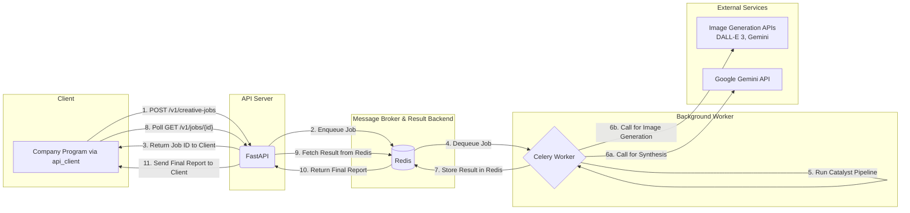

# 🚀 Creative Catalyst Engine

[](https://github.com/your-username/creative-catalyst-engine)
[](LICENSE)

The **Creative Catalyst Engine** is an AI-powered idea-to-image pipeline delivered as a scalable web service. It transforms a simple creative brief into a multi-format fashion intelligence package: a structured trend report (JSON), art-directed narrative prompts, and editorial-quality images generated by modern generative models.

Built on FastAPI, Celery, and Redis, the engine is designed for resilience, scalability, and easy integration into creative workflows.

---

## Table of Contents

- [🚀 Creative Catalyst Engine](#-creative-catalyst-engine)
  - [Table of Contents](#table-of-contents)
  - [Key Features](#key-features)
  - [Architecture Overview](#architecture-overview)
  - [Repository Structure](#repository-structure)
  - [Setup and Configuration](#setup-and-configuration)
    - [Prerequisites](#prerequisites)
    - [Installation](#installation)
    - [Environment Variables](#environment-variables)
  - [Running the Engine](#running-the-engine)
    - [1) Start Redis (Docker)](#1-start-redis-docker)
    - [2) Start Celery Worker](#2-start-celery-worker)
    - [3) Start the API Server](#3-start-the-api-server)
  - [Interacting with the Engine](#interacting-with-the-engine)
    - [Recommended: Use the API client](#recommended-use-the-api-client)
    - [Direct API (curl)](#direct-api-curl)
    - [Local testing (debugging pipeline)](#local-testing-debugging-pipeline)
  - [Outputs](#outputs)
  - [Troubleshooting](#troubleshooting)
  - [Notes on Rendering](#notes-on-rendering)

---

## Key Features

*   **Asynchronous & Scalable**: FastAPI front end accepts jobs immediately and queues them to Celery + Redis for background processing.
*   **Multi-Model Image Generation**: Easily switch between different image generation models (DALL-E 3, Google Gemini, etc.) via a simple configuration change.
*   **AI Creative Direction**: Intermediate AI step converts brand ethos to photography direction (lighting, mood, model persona).
*   **Deep Ethos Analysis**: Uses semantic analysis to align outputs with the user's core creative philosophy.
*   **Robust Synthesis Engine**: Constraint-driven prompts and fallback strategies deliver logically-sound, detailed JSON reports.
*   **L1 Report Caching**: ChromaDB-backed cache speeds up re-runs for similar briefs.
*   **Configurable Feature Flags**: Toggle features (like image generation) via environment variables for testing/cost control.

---

## Architecture Overview

The engine is architected as a modern, decoupled web service for scalability and resilience. The diagram below illustrates the flow of a request from the client to the final result.

<br>

<details>
<summary>Click to view the Mermaid diagram source code</summary>


</details>

---

## Repository Structure

```
creative-catalyst-engine/
├── .env
├── README.md
├── requirements.txt
│
├── api/
│   ├── main.py
│   ├── worker.py
│   └── eventlet_worker.py
│
├── api_client/
│   ├── client.py
│   ├── exceptions.py
│   └── example.py
│
└── catalyst/
    ├── main.py
    ├── settings.py
    ├── ...
    └── pipeline/
        ├── base_processor.py
        ├── orchestrator.py
        └── processors/
            ├── briefing.py
            ├── synthesis.py
            ├── reporting.py
            └── generation/
                ├── __init__.py
                ├── base_generator.py
                ├── dalle3_generator.py
                ├── gpt_image1_generator.py
                └── nanobanana_generator.py
```

---

## Setup and Configuration

### Prerequisites

*   **Python 3.11+**
*   **Docker Desktop** (for Redis). Install: [https://www.docker.com/products/docker-desktop](https://www.docker.com/products/docker-desktop)

### Installation

```bash
git clone https://github.com/your-username/creative-catalyst-engine.git
cd creative-catalyst-engine

python3 -m venv venv
source venv/bin/activate

pip install -r requirements.txt
```

### Environment Variables

Create a `.env` file in the project root (ignored by Git).

```ini
# .env

# Required API keys
GEMINI_API_KEY="your_gemini_api_key_here"
OPENAI_API_KEY="your_openai_api_key_here"

# Feature flags & Model Selection
ENABLE_IMAGE_GENERATION=True
IMAGE_GENERATION_MODEL="dall-e-3"  # Options: "dall-e-3", "gpt-image-1", "nano-banana"

# Infrastructure
REDIS_URL="redis://localhost:6379/0"
```

---

## Running the Engine

You will typically run three processes in separate terminals (API, Celery worker, and Redis container).

### 1) Start Redis (Docker)

```bash
docker run -d -p 6379:6379 --name creative-catalyst-redis redis
# or, if already created:
docker start creative-catalyst-redis
```

### 2) Start Celery Worker

Terminal 1 (Linux / WSL):
```bash
source venv/bin/activate
celery -A api.worker.celery_app worker --loglevel=info
```

macOS (use eventlet to avoid certain macOS networking issues):
```bash
source venv/bin/activate
celery -A api.eventlet_worker.celery_app worker --loglevel=info -P eventlet
```

### 3) Start the API Server

Terminal 2:
```bash
source venv/bin/activate
# Use --host 0.0.0.0 to make the server accessible from other computers on your network
uvicorn api.main:app --reload --port 9500 --host 0.0.0.0
```

Server URL for local testing: `http://127.0.0.1:9500`.
(Use your computer's network IP address to connect from other machines).

---

## Interacting with the Engine

### Recommended: Use the API client

Run the example client to submit a job, poll for results, and download the generated images:

```bash
python -m api_client.example
```

### Direct API (curl)

Submit a job:
```bash
curl -X POST "http://127.0.0.1:9500/v1/creative-jobs" \
  -H "Content-Type: application/json" \
  -d '{"user_passage": "A report on the New Look silhouette, modernized for today\'s Dior."}'
```
That returns a `job_id` you can poll with `GET /v1/creative-jobs/{job_id}`.

### Local testing (debugging pipeline)

Edit `catalyst/main.py` and change `USER_PASSAGE`, then:
```bash
python -m catalyst.main
```

---

## Outputs

On success, outputs are stored under `./results/` in a timestamped folder. The API response will contain:
*   `final_report`: The full, structured JSON trend report.
*   `image_urls`: A list of public URLs to the generated images, which can be downloaded by the client.

---

## Troubleshooting

*   **502 Bad Gateway / Could not connect:** This is a network issue.
    1.  Ensure the API server is running (`uvicorn ...`).
    2.  If connecting from another machine, ensure you started the server with `--host 0.0.0.0` and are using the correct network IP address, not `127.0.0.1`.
    3.  Check for firewalls blocking port `9500`.
*   **API response has an empty `image_urls` list:** Check the Celery worker logs. This means the image generation step was either disabled (`ENABLE_IMAGE_GENERATION=False`) or failed. The worker log will contain the specific error traceback.
*   **500 Internal Server Error:** Check the Celery worker logs. This indicates an error during the background job execution.
*   **ModuleNotFoundError when running client:** Run from the project's root directory and use `python -m api_client.example`.

---

## Notes on Rendering

*   **Project title visibility**: If your README begins with large badges or HTML comments before the first H1, some viewers or site integrations may display the repository name instead of the README H1. To be safe, place the `# Title` at the very top (as done above).
*   **Mermaid diagrams**:
    *   Use `\n` for multi-line node labels (avoid raw HTML like `<br>`).
    *   If the diagram still doesn’t render in your environment, try using an online editor or a VS Code extension with Mermaid support.