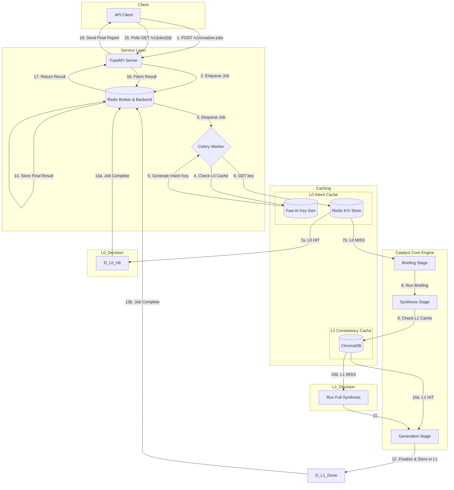

# 🚀 Creative Catalyst Engine

[](https://github.com/Technyx/creative-catalyst-engine)
[](LICENSE)

The **Creative Catalyst Engine** is an AI-powered idea-to-image pipeline delivered as a scalable web service. It transforms a simple, high-level creative brief into a multi-format fashion intelligence package: a structured trend report (JSON), art-directed narrative prompts, and a suite of editorial-quality images.

Built on FastAPI, Celery, and Redis, the engine is designed for resilience, scalability, and easy integration into creative workflows. It features an intelligent, multi-level caching system that provides instant responses for repeated requests and ensures 100% consistency for semantically similar inputs.

---

## Table of Contents

- [🚀 Creative Catalyst Engine](#-creative-catalyst-engine)
  - [Table of Contents](#table-of-contents)
  - [Guiding Principles](#guiding-principles)
  - [Key Features](#key-features)
  - [Architecture Overview](#architecture-overview)
  - [Repository Structure](#repository-structure)
  - [Setup and Configuration](#setup-and-configuration)
    - [Prerequisites](#prerequisites)
    - [Installation](#installation)
    - [Environment Variables](#environment-variables)
  - [Running the Engine](#running-the-engine)
      - [1. Start Redis](#1-start-redis)
      - [2. Start Celery Worker](#2-start-celery-worker)
      - [3. Start the API Server](#3-start-the-api-server)
  - [Interacting with the Engine](#interacting-with-the-engine)
    - [Recommended: Use the API Client](#recommended-use-the-api-client)
    - [Direct API (curl)](#direct-api-curl)
  - [API Output Structure](#api-output-structure)
  - [Troubleshooting](#troubleshooting)

---

## Guiding Principles

This engine is built with a few core architectural principles in mind:

*   **Separation of Concerns:** The **Service Layer** (`api/`) is strictly decoupled from the **Core Engine** (`catalyst/`). The API knows how to handle web requests and jobs, while the engine knows how to generate fashion reports. This makes the system modular and easier to maintain.
*   **Intelligent, Multi-Level Caching:** Caching is not an afterthought. A high-speed **L0 Intent Cache** prevents the entire pipeline from running on semantically identical requests, while a **L1 Consistency Cache** ensures that different phrasings of the same idea produce identical, high-quality results without redundant work.
*   **Configuration over Code:** Key behaviors, such as API keys, URLs, and the choice of image generation model, are controlled via environment variables (`.env`), not hardcoded values.

---

## Key Features

*   **Asynchronous & Scalable**: A FastAPI front-end accepts jobs immediately and queues them to Celery + Redis for resilient, non-blocking background processing.
*   **Intelligent Multi-Level Caching**:
    *   **L0 Intent Cache (High-Speed):** A pre-inference cache that uses a fast AI call to create a deterministic key from the user's *intent*, providing instant results for semantically identical requests, even with different wording.
    *   **L1 Consistency Cache (Semantic):** A vector-based cache that ensures if two different requests are interpreted to have the same meaning, the final output is 100% consistent, preventing redundant synthesis.
*   **AI Creative Direction**: Translates the brand ethos and trend data into a professional photography style guide, which is then used to generate highly specific, art-directed image prompts.
*   **Demographic-Aware Inference**: Intelligently infers gender and ethnicity from the creative brief to generate highly relevant and context-aware model imagery, while actively avoiding generic defaults.
*   **Rich Artifact Generation**: Produces a complete creative package, including a detailed JSON report, mood board prompts, and final garment image prompts.
*   **Pluggable Image Generation**: Easily switch between image generation models (e.g., Gemini, DALL-E 3) via a simple configuration change.

---

## Architecture Overview

The engine is architected as a modern, decoupled web service. The diagram below illustrates the full request and polling lifecycle, including the two-level caching strategy.

<details>
<summary>Click to view the Mermaid diagram source code</summary>


</details>

---

## Repository Structure

The project is organized into two main layers: the `api` (Service Layer) and `catalyst` (Core Engine).

*   `api/` - The Service Layer. Handles all web requests, job queuing, and service-level caching. It is the public-facing entry point to the system.
*   `api_client/` - A standalone Python client demonstrating how to interact with the API.
*   `catalyst/` - The Core Engine. Contains all the business logic for generating fashion reports. It is a self-contained unit that knows nothing about the web.
*   `artifact_cache/` - Permanent, persistent storage for L1 cached artifacts (reports & images).
*   `results/` - Rotating, temporary storage for the `N` most recent user-facing runs.

```
creative-catalyst-engine/
├── .env                  # Local environment variables (API keys, URLs). Ignored by Git.
├── README.md             # The main project documentation.
├── requirements.txt      # Python package dependencies.
│
├── api/                  # SERVICE LAYER: Handles web requests and background jobs.
│   ├── __init__.py
│   ├── main.py           # FastAPI application, defines API endpoints.
│   ├── worker.py         # Celery worker definition and the main task orchestrator.
│   ├── cache.py          # L0 Intent Cache logic using AI-driven key generation.
│   └── eventlet_worker.py# Celery entry point for macOS to enable eventlet patching.
│
├── api_client/           # A standalone Python client for interacting with the API.
│   ├── __init__.py
│   ├── client.py         # The core client class for submitting jobs and polling results.
│   ├── exceptions.py     # Custom exceptions for the API client.
│   └── example.py        # A runnable example demonstrating how to use the client.
│
├── artifact_cache/       # Permanent, persistent storage for L1 cached artifacts (reports & images).
│
├── catalyst/             # CORE ENGINE (DOMAIN LAYER): The main application logic.
│   ├── __init__.py
│   ├── main.py           # Entry point for local testing (`python -m catalyst.main`).
│   ├── settings.py       # Central configuration for the application.
│   ├── context.py        # Defines the `RunContext` data object for the pipeline.
│   │
│   ├── caching/          # L1 Semantic Cache logic.
│   │   ├── __init__.py
│   │   ├── cache_manager.py  # Facade for interacting with the L1 cache.
│   │   └── report_cache.py   # ChromaDB implementation of the L1 semantic cache.
│   │
│   ├── clients/          # Clients for communicating with external services.
│   │   ├── __init__.py
│   │   └── gemini_client.py  # Client for interacting with the Google Gemini API.
│   │
│   ├── config/           # Static configuration files.
│   │   └── sources.yaml    # Curated list of sources for the web research step.
│   │
│   ├── models/           # Pydantic data models defining the final report structure.
│   │   ├── __init__.py
│   │   └── trend_report.py
│   │
│   ├── pipeline/         # The core multi-stage processing pipeline logic.
│   │   ├── __init__.py
│   │   ├── orchestrator.py   # Manages the execution flow of the pipeline steps.
│   │   ├── base_processor.py # Abstract base class for all pipeline processors.
│   │   │
│   │   └── processors/     # Directory for all individual pipeline steps.
│   │       ├── __init__.py
│   │       ├── briefing.py     # Processors for deconstruction and enrichment.
│   │       ├── synthesis.py    # Processors for research and report synthesis.
│   │       ├── reporting.py    # Processor for generating final prompts.
│   │       │
│   │       └── generation/   # Pluggable image generation strategies.
│   │           ├── __init__.py
│   │           ├── base_generator.py
│   │           ├── dalle3_generator.py
│   │           ├── gpt_image1_generator.py
│   │           └── nanobanana_generator.py
│   │
│   ├── prompts/          # Library of all major AI prompt templates.
│   │   ├── __init__.py
│   │   └── prompt_library.py
│   │
│   └── utilities/        # Shared helper modules.
│       ├── __init__.py
│       ├── logger.py         # Centralized logging configuration.
│       └── config_loader.py  # Helper to load and format `sources.yaml`.
│
├── chroma_cache/         # Directory for the ChromaDB vector store (L1 cache).
│
├── logs/                 # Directory for log files.
│
└── results/              # Rotating storage for the N most recent user-facing runs.
```

---

## Setup and Configuration

### Prerequisites

*   Python 3.11+
*   Docker Desktop (for Redis)

### Installation

```bash
git clone https://github.com/Technyx/creative-catalyst-engine.git
cd creative-catalyst-engine

python3 -m venv venv
source venv/bin/activate

pip install -r requirements.txt
```

### Environment Variables

Create a `.env` file in the project root. This file is ignored by Git.

```ini
# .env

# --- API Keys & Secrets ---
GEMINI_API_KEY="your_gemini_api_key_here"
OPENAI_API_KEY="your_openai_api_key_here" # For DALL-E

# --- Feature Flags & Model Selection ---
ENABLE_IMAGE_GENERATION=True
IMAGE_GENERATION_MODEL="nano-banana"  # Options: "dall-e-3", "nano-banana"

# --- Infrastructure & Networking ---
REDIS_URL="redis://localhost:6379/0"

# The public-facing base URL for this server. This is CRITICAL for
# ensuring the image URLs in the final report are accessible by clients.
ASSET_BASE_URL="http://127.0.0.1:9500"
```

---

## Running the Engine

You will typically run three processes in separate terminals.

#### 1. Start Redis

```bash
# Run this once to create the container
docker run -d -p 6379:6379 --name creative-catalyst-redis redis

# Use this to start it in the future
docker start creative-catalyst-redis
```

#### 2. Start Celery Worker

**Terminal 1 (Linux / WSL):**
```bash
source venv/bin/activate
celery -A api.worker.celery_app worker --loglevel=info
```**Terminal 1 (macOS - requires eventlet):**
```bash
source venv/bin/activate
celery -A api.eventlet_worker.celery_app worker --loglevel=info -P eventlet
```

#### 3. Start the API Server

**Terminal 2:**
```bash
source venv/bin/activate
# The --host 0.0.0.0 flag is crucial for allowing other machines to connect.
uvicorn api.main:app --reload --port 9500 --host 0.0.0.0
```

---

## Interacting with the Engine

### Recommended: Use the API Client

For a full end-to-end test, run the example client.
```bash
python -m api_client.example
```

### Direct API (curl)

**1. Submit a job:**
```bash
curl -X POST "http://127.0.0.1:9500/v1/creative-jobs" \
  -H "Content-Type: application/json" \
  -d '{"user_passage": "A report on the New Look silhouette, modernized for today''s Dior."}'
```

**2. Poll for the result:**
The above command will return a `job_id`. Use it to poll the status endpoint.
```bash
curl "http://127.0.0.1:9500/v1/creative-jobs/{your_job_id_here}"
```

---

## API Output Structure

When you poll a completed job, the response will contain a `result` key. The full trend report and artifact paths are nested inside this key. Image URLs are embedded directly within each key piece.

**Example `GET /v1/creative-jobs/{id}` Response:**
```json
{
  "job_id": "your-job-id",
  "status": "complete",
  "result": {
    "final_report": {
      "overarching_theme": "The Gorpcore Aesthetic...",
      "detailed_key_pieces": [
        {
          "key_piece_name": "The Urban Tech Shell",
          "description": "A versatile shell jacket...",
          "final_garment_image_url": "http://127.0.0.1:9500/results/20250903-103000_gorpcore/the-urban-tech-shell.png",
          "mood_board_image_url": "http://127.0.0.1:9500/results/20250903-103000_gorpcore/the-urban-tech-shell-moodboard.png"
        }
      ]
    },
    "artifacts_path": "/path/to/project/results/20250903-103000_gorpcore"
  }
}
```

---

## Troubleshooting

*   **Could not connect / 502 Bad Gateway:** A network issue. Ensure the API server (`uvicorn`) is running. If connecting from another machine, ensure you started the server with `--host 0.0.0.0` and that the client is using the server's correct LAN IP address.
*   **Images not downloading / URLs are incorrect:** Check that the `ASSET_BASE_URL` in your `.env` file is set to the correct public-facing address of your server.
*   **500 Internal Server Error:** Check the logs in your **Celery worker terminal**. This indicates an error during the background job execution, and the full traceback will be printed there.