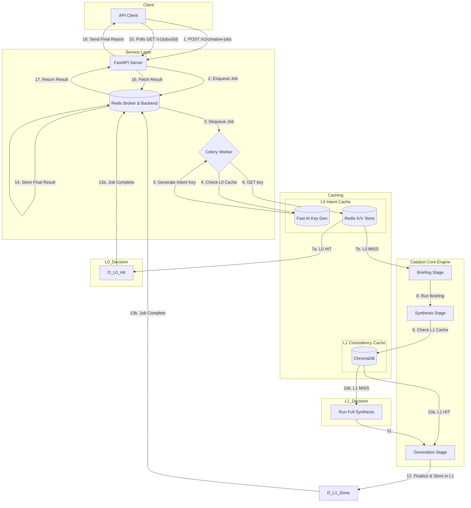

# 🚀 Creative Catalyst Engine

[](https://github.com/Technyx/creative-catalyst-engine)
[](LICENSE)

The **Creative Catalyst Engine** is an AI-powered, idea-to-image pipeline delivered as a scalable and resilient web service. It transforms a simple creative brief into a multi-format fashion intelligence package: a structured trend report (JSON), an art-directed style guide, and a suite of editorial-quality images.

Built on a robust stack of FastAPI, Celery, and Redis, the engine is architected for high performance, true asynchronicity, and long-term maintainability. It features an intelligent, multi-level caching system and a modular, strategy-based design for its core logic, making it a reliable foundation for creative AI workflows.

---

## Table of Contents

- [🚀 Creative Catalyst Engine](#-creative-catalyst-engine)
  - [Table of Contents](#table-of-contents)
  - [Guiding Principles](#guiding-principles)
  - [Key Features](#key-features)
  - [Architecture Overview](#architecture-overview)
  - [Repository Structure](#repository-structure)
  - [Setup and Configuration](#setup-and-configuration)
    - [Prerequisites](#prerequisites)
    - [Installation](#installation)
    - [Environment Variables](#environment-variables)
  - [Running the Engine](#running-the-engine)
    - [Terminal 1: Start Redis](#terminal-1-start-redis)
    - [Terminal 2: Start Celery Worker](#terminal-2-start-celery-worker)
    - [Terminal 3: Start the API Server](#terminal-3-start-the-api-server)
  - [Interacting with the Engine](#interacting-with-the-engine)
    - [Recommended: Use the API Client](#recommended-use-the-api-client)
    - [Direct API (curl)](#direct-api-curl)
    - [Local testing (debugging pipeline)](#local-testing-debugging-pipeline)
  - [API Output Structure](#api-output-structure)
  - [Troubleshooting](#troubleshooting)

---

## Guiding Principles

This engine is built with a few core architectural principles in mind:

*   **Separation of Concerns:** The **Service Layer** (`api/`) is strictly decoupled from the **Core Engine** (`catalyst/`). The API handles web requests and jobs, while the engine focuses purely on generating fashion intelligence. This modularity makes the system easier to maintain and test.
*   **Resilience by Design:** The pipeline features granular, stage-aware exception handling, and the external API clients have built-in retry and backoff logic. The system is designed to salvage partial results from non-critical failures, maximizing value on every run.
*   **Strategy-Based Logic:** Complex, multi-step operations (like report synthesis and prompt generation) are encapsulated in dedicated "strategy" classes. This eliminates code duplication and makes the core pipeline processors lean, readable controllers.
*   **Configuration over Code:** Key behaviors, such as API keys, URLs, and the choice of image generation model, are controlled via environment variables (`.env`), not hardcoded values.

---

## Key Features

*   **True Asynchronous Processing**: A FastAPI front-end accepts jobs and queues them to Celery. The tasks themselves are fully `async`, ensuring non-blocking I/O throughout the pipeline for maximum throughput.
*   **Modular, Strategy-Based Architecture**: Core logic is delegated to specialized, reusable components (`ReportAssembler`, `PromptGenerator`), adhering to SOLID principles and making the system highly maintainable.
*   **Intelligent Multi-Level Caching**:
    *   **L0 Intent Cache (High-Speed):** A pre-inference Redis cache that provides instant results for semantically identical requests, even with different wording.
    *   **L1 Consistency Cache (Semantic):** A vector-based ChromaDB cache that ensures different phrasings of the same core idea produce identical, high-quality results without redundant work.
*   **Resilient, Native Async API Client**: A custom, modular client for the Gemini API with built-in exponential backoff and retry logic, using the latest native `async` methods for optimal performance.
*   **AI Creative Direction**: Translates trend data into a professional photography style guide, which is then used to generate highly specific, art-directed image prompts.
*   **Robust Artifact Handling**: A transaction-like caching mechanism with automatic rollback prevents data corruption and orphaned files, ensuring data integrity between the file system and the vector database.

---

## Architecture Overview

The engine is architected as a modern, decoupled web service. The diagram below illustrates the full request lifecycle, including the two-level caching strategy.

<details>
<summary>Click to view the Mermaid diagram source code</summary>


</details>

---

## Repository Structure

The project is organized into distinct layers and features, promoting high cohesion and low coupling.

```
creative-catalyst-engine/
├── .env                  # Local environment variables (API keys, URLs).
├── README.md
├── requirements.txt
│
├── api/                  # SERVICE LAYER: Handles web requests and background jobs.
│   ├── main.py           # FastAPI application, defines API endpoints.
│   └── worker.py         # Celery worker with the main async task orchestrator.
│
├── api_client/           # A standalone Python client for interacting with the API.
│
├── catalyst/             # CORE ENGINE (DOMAIN LAYER): The main application logic.
│   ├── main.py           # Entry point for local testing and the core `run_pipeline` function.
│   ├── settings.py       # Central configuration for the application.
│   ├── context.py        # Defines the `RunContext` data object.
│   │
│   ├── caching/          # L1 Semantic Cache logic (ChromaDB).
│   │
│   ├── clients/          # Clients for communicating with external services.
│   │   └── gemini/       # --> Modular, native async client for the Gemini API.
│   │
│   ├── models/           # Pydantic data models for the final report structure.
│   │
│   └── pipeline/         # The core multi-stage processing pipeline.
│       ├── orchestrator.py   # Manages the pipeline execution flow and granular error handling.
│       │
│       ├── processors/     # --> Lean processors that act as pipeline step controllers.
│       │   ├── briefing.py
│       │   ├── synthesis.py
│       │   ├── reporting.py
│       │   └── generation/
│       │
│       ├── synthesis_strategies/ # --> NEW: Encapsulated logic for building reports.
│       │   └── report_assembler.py
│       │
│       └── prompt_engineering/   # --> NEW: Encapsulated logic for generating prompts.
│           └── prompt_generator.py
│
├── artifact_cache/       # Permanent, persistent storage for L1 cached artifacts.
├── chroma_cache/         # Directory for the ChromaDB vector store (L1 cache).
├── logs/
└── results/              # Rotating storage for the N most recent user-facing runs.
```

---

## Setup and Configuration

### Prerequisites

*   Python 3.11+
*   Docker Desktop (for Redis)

### Installation

```bash
git clone https://github.com/MTawhid7/creative-catalyst-engine.git
cd creative-catalyst-engine

python3 -m venv venv
source venv/bin/activate

pip install -r requirements.txt
```

### Environment Variables

Create a `.env` file in the project root. This file is ignored by Git.

```ini
# .env

# --- API Keys & Secrets ---
GEMINI_API_KEY="your_gemini_api_key_here"
OPENAI_API_KEY="your_openai_api_key_here" # For DALL-E (optional)

# --- Feature Flags & Model Selection ---
ENABLE_IMAGE_GENERATION=True
IMAGE_GENERATION_MODEL="nano-banana"  # Options: "dall-e-3", "nano-banana"

# --- Infrastructure & Networking ---
REDIS_URL="redis://localhost:6379/0"

# CRITICAL: This MUST be the public-facing base URL of your server.
# It is used to construct the absolute URLs for images in the final report.
# For local testing, http://127.0.0.1:9500 is correct.
ASSET_BASE_URL="http://127.0.0.1:9500"
```

---

## Running the Engine

You will run three processes in separate terminals.

### Terminal 1: Start Redis

```bash
# Run this once to create and name the container
docker run -d -p 6379:6379 --name creative-catalyst-redis redis

# Use this to start/stop it in the future
docker start creative-catalyst-redis
```

### Terminal 2: Start Celery Worker

**For Linux / WSL:**
```bash
source venv/bin/activate
celery -A api.worker.celery_app worker --loglevel=info
```
**For macOS (requires `eventlet`):**
```bash
source venv/bin/activate
celery -A api.eventlet_worker.celery_app worker --loglevel=info -P eventlet
```

### Terminal 3: Start the API Server

```bash
source venv/bin/activate
# The --host 0.0.0.0 flag is crucial for allowing other machines to connect.
uvicorn api.main:app --reload --port 9500 --host 0.0.0.0
```

---

## Interacting with the Engine

### Recommended: Use the API Client

For a full end-to-end test, run the example client from the project root:
```bash
python -m api_client.example
```

### Direct API (curl)

**1. Submit a job:**
```bash
curl -X POST "http://127.0.0.1:9500/v1/creative-jobs" \
  -H "Content-Type: application/json" \
  -d '{"user_passage": "A report on the New Look silhouette, modernized for today''s Dior."}'
```

**2. Poll for the result:**
The command will return a `job_id`. Use it to poll the status endpoint.
```bash
curl "http://127.0.0.1:9500/v1/creative-jobs/{your_job_id_here}"
```

---

### Local testing (debugging pipeline)

Edit `catalyst/main.py` and change `USER_PASSAGE`, then:
```bash
python -m catalyst.main
```

---

## API Output Structure

A completed job response contains the final report with image URLs embedded directly within each key piece.

**Example `GET /v1/creative-jobs/{id}` Response:**
```json
{
  "job_id": "your-job-id",
  "status": "complete",
  "result": {
    "final_report": {
      "overarching_theme": "The Gorpcore Aesthetic...",
      "detailed_key_pieces": [
        {
          "key_piece_name": "The Urban Tech Shell",
          "description": "A versatile shell jacket...",
          "final_garment_image_url": "http://127.0.0.1:9500/results/20250908-143000_gorpcore/the-urban-tech-shell.png",
          "mood_board_image_url": "http://127.0.0.1:9500/results/20250908-143000_gorpcore/the-urban-tech-shell-moodboard.png"
        }
      ]
    },
    "artifacts_path": "/path/to/project/results/20250908-143000_gorpcore"
  }
}
```

---

## Troubleshooting

*   **500 Internal Server Error:** Check the logs in your **Celery worker terminal**. This indicates an error during the background job execution, and the full traceback will be printed there.
*   **Images not downloading / URLs are incorrect:** The `ASSET_BASE_URL` in your `.env` file is almost certainly incorrect. It must be the public-facing address of your server that the client machine can reach (e.g., `http://<your_server_lan_ip>:9500` if testing on a local network).
*   **Could not connect / 502 Bad Gateway:** Ensure the API server (`uvicorn`) is running and that you started it with `--host 0.0.0.0` if connecting from another machine.
*   **Celery worker on macOS fails to start:** Ensure you are using the `eventlet_worker.py` entry point as described in the run commands, which is required for Celery on macOS.