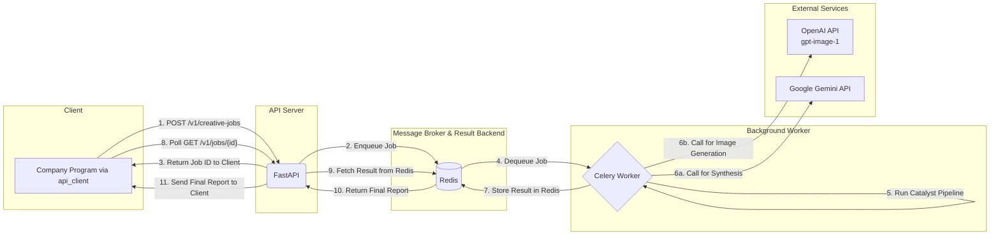

---

# 🚀 Creative Catalyst Engine

[](https://github.com/your-username/creative-catalyst-engine)
[](LICENSE)

The **Creative Catalyst Engine** is an AI-powered idea-to-image pipeline delivered as a scalable web service. It transforms a simple creative brief into a multi-format fashion intelligence package: a structured trend report (JSON), art-directed narrative prompts, and editorial-quality images generated by modern generative models.

Built on FastAPI, Celery, and Redis, the engine is designed for resilience, scalability, and easy integration into creative workflows.

---

## Table of Contents

- [🚀 Creative Catalyst Engine](#-creative-catalyst-engine)
  - [Table of Contents](#table-of-contents)
  - [Key Features](#key-features)
  - [Architecture Overview](#architecture-overview)
  - [Repository Structure](#repository-structure)
  - [Setup and Configuration](#setup-and-configuration)
    - [Prerequisites](#prerequisites)
    - [Installation](#installation)
    - [Environment Variables](#environment-variables)
  - [Running the Engine](#running-the-engine)
    - [1) Start Redis (Docker)](#1-start-redis-docker)
    - [2) Start Celery Worker](#2-start-celery-worker)
    - [3) Start the API Server](#3-start-the-api-server)
  - [Interacting with the Engine](#interacting-with-the-engine)
    - [Recommended: Use the API client](#recommended-use-the-api-client)
    - [Direct API (curl)](#direct-api-curl)
    - [Local testing (debugging pipeline)](#local-testing-debugging-pipeline)
  - [Outputs](#outputs)
  - [Troubleshooting](#troubleshooting)
  - [Notes on Rendering](#notes-on-rendering)

---

## Key Features

* **Asynchronous & Scalable**: FastAPI front end accepts jobs immediately and queues them to Celery + Redis for background processing.
* **High-quality Image Generation**: Integrates with OpenAI-style image models to produce editorial-style images.
* **AI Creative Direction**: Intermediate AI step converts brand ethos to photography direction (lighting, mood, model persona).
* **Deep Ethos Analysis**: Uses semantic analysis to align outputs with the user's core creative philosophy.
* **Robust Synthesis Engine**: Constraint-driven prompts and fallback strategies deliver logically-sound, detailed JSON reports.
* **L1 Report Caching**: ChromaDB-backed cache speeds up re-runs for similar briefs.
* **Configurable Feature Flags**: Toggle features (like image generation) via environment variables for testing/cost control.

---

## Architecture Overview

The engine is architected as a modern, decoupled web service for scalability and resilience. The diagram below illustrates the flow of a request from the client to the final result.


<br>

<details>
<summary>Click to view the Mermaid diagram source code</summary>


</details>


---

## Repository Structure

```
creative-catalyst-engine/
├── .env
├── README.md
├── requirements.txt
│
├── api/
│   ├── main.py
│   ├── worker.py
│   └── eventlet_worker.py
│
├── api_client/
│   ├── client.py
│   ├── exceptions.py
│   └── example.py
│
└── catalyst/
    ├── main.py
    ├── settings.py
    ├── context.py
    ├── config/
    │   └── sources.yaml
    ├── clients/
    │   └── gemini_client.py
    ├── models/
    │   └── trend_report.py
    ├── prompts/
    │   └── prompt_library.py
    ├── caching/
    │   ├── cache_manager.py
    │   └── report_cache.py
    ├── utilities/
    │   ├── config_loader.py
    │   └── logger.py
    └── pipeline/
        ├── base_processor.py
        ├── orchestrator.py
        └── processors/
            ├── briefing.py
            ├── synthesis.py
            ├── reporting.py
            └── generation.py
```

---

## Setup and Configuration

### Prerequisites

* **Python 3.11+**
* **Docker Desktop** (for Redis). Install: [https://www.docker.com/products/docker-desktop](https://www.docker.com/products/docker-desktop)

### Installation

```bash
git clone https://github.com/your-username/creative-catalyst-engine.git
cd creative-catalyst-engine

python3 -m venv venv
source venv/bin/activate

pip install -r requirements.txt
```

### Environment Variables

Create a `.env` file in the project root (ignored by Git).

```ini
# .env

# Required API keys
GEMINI_API_KEY="your_gemini_api_key_here"
OPENAI_API_KEY="your_openai_api_key_here"   # previously DALLE_API_KEY — prefer OPENAI_API_KEY

# Feature flags
ENABLE_IMAGE_GENERATION=True
REDIS_URL="redis://localhost:6379/0"
```

---

## Running the Engine

You will typically run three processes (API, Celery worker, and Redis container).

### 1) Start Redis (Docker)

```bash
docker run -d -p 6379:6379 --name creative-catalyst-redis redis
# or, if already created:
docker start creative-catalyst-redis
```

### 2) Start Celery Worker

Terminal 1 (Linux / WSL):

```bash
source venv/bin/activate
celery -A api.worker.celery_app worker --loglevel=info
```

macOS (use eventlet to avoid certain macOS networking issues):

```bash
source venv/bin/activate
celery -A api.eventlet_worker.celery_app worker --loglevel=info -P eventlet
```

### 3) Start the API Server

Terminal 2:

```bash
source venv/bin/activate
uvicorn api.main:app --reload
```

Server URL: `http://127.0.0.1:8000` (note: corrected from `122.0.0.1`).

---

## Interacting with the Engine

### Recommended: Use the API client

Run the example client to submit a job and poll for results:

```bash
python -m api_client.example
```

### Direct API (curl)

Submit a job:

```bash
curl -X POST "http://127.0.0.1:8000/v1/creative-jobs" \
  -H "Content-Type: application/json" \
  -d '{"user_passage": "A report on the New Look silhouette, modernized for today\'s Dior."}'
```

That returns a `job_id` you can poll with `GET /v1/creative-jobs/{job_id}`.

### Local testing (debugging pipeline)

Edit `catalyst/main.py` and change `USER_PASSAGE`, then:

```bash
python -m catalyst.main
```

---

## Outputs

On success, outputs are stored under `./results/` in a timestamped folder, e.g.:

* `itemized_fashion_trends.json`
* `generated_prompts.json`
* `[garment-name].png`
* `debug_run_artifacts.json`

---

## Troubleshooting

* **422 Unprocessable Entity**: request body structure mismatch. Make sure you send `{"user_passage": "..."}`.
* **500 Internal Server Error**: check Celery worker logs — examine the terminal running the worker for tracebacks.
* **ModuleNotFoundError when running client:** run from repo root and use `python -m api_client.example`.
* **Mermaid not rendering in your local preview:** see the Notes on Rendering below.

---

## Notes on Rendering

* **Project title visibility**: If your README begins with large badges or HTML comments before the first H1, some viewers or site integrations may display the repository name instead of the README H1. To be safe, place the `# Title` at the very top (as done above).
* **Mermaid diagrams**:

  * Use `\n` for multi-line node labels (avoid raw HTML like `<br>`).
  * If the diagram still doesn’t render in your environment, try:

    * Opening the file on GitHub (their renderer supports Mermaid).
    * Using [https://mermaid.live/](https://mermaid.live/) to paste the diagram and preview.
    * VS Code: install the "Markdown Preview Mermaid Support" extension.
* **Badges**: badges are fine after the H1. If a specific badge blocks rendering, temporarily remove it to debug.

---
